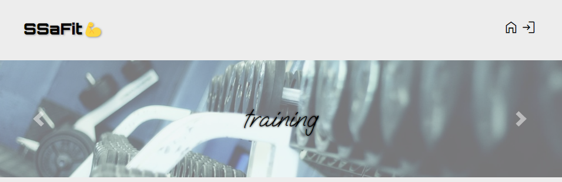
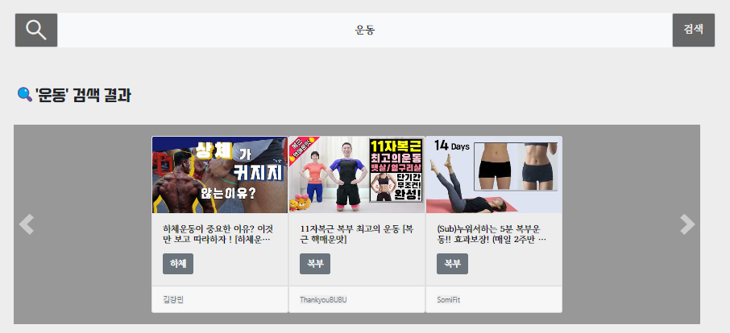
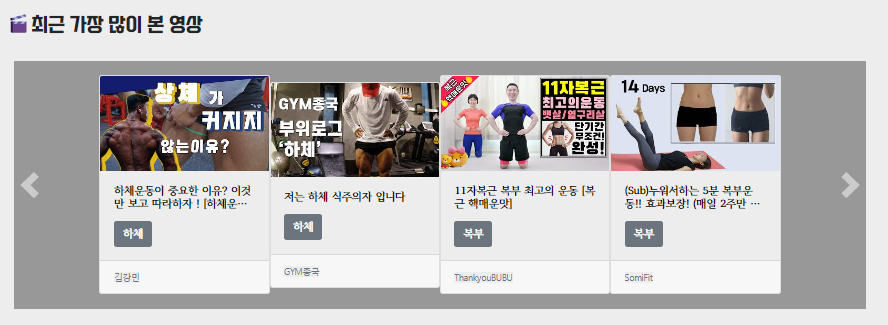
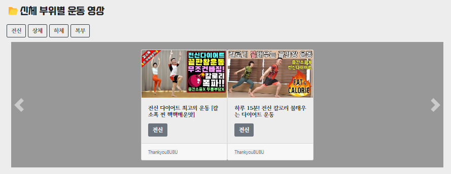
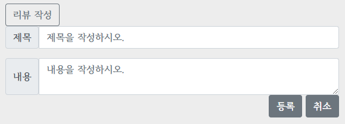
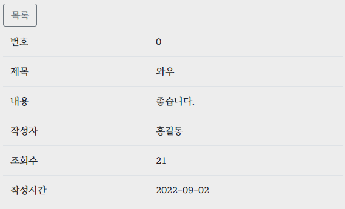

# SSAFIT Front-end PJT

- 2022.09.02 (금)
- 서지윤, 서주광

## :dango:구현

### 로그인 페이지

1. 가운데에 커서를 가져다 놓으면 로그인 화면이 드러난다.
2. 아이디와 비밀번호를 치는 input창과, 버튼 생성
3. 버튼을 누르면 아이디와 비밀번호가 동시에 일치하는지, user.json 파일과 비교
4. 일치하는 것이 있으면, 유저 정보를 localStorage에 저장(비밀번호 제외)
5. 회원가입 버튼 누르면 회원가입 페이지로 이동(아이디,패스워드,이름,닉네임,이메일)

### 메인 페이지

1. header
   
   - 사이트 제목과 홈, 로그인 창으로 연결하는 아이콘을 생성
   - 자동으로 움직이는 슬라이더 배너 삽입
2. search
   
   - 키워드를 입력한 뒤, Enter 또는 검색 버튼을 누르면 해당 키워드가 들어간 영상 목록을 가져온다.
   - 모든 영상 목록은 bootstrap의 card를 활용해 표현했고, carousel로 슬라이더 구현
3. recent
   
4. part
   
   - 운동 부위가 적혀있는 버튼을 클릭하면 해당 부위를 운동하는 영상 목록을 가져온다.
5. 상세 페이지 이동
   - 이미지를 클릭하면, 해당 이미지의 번호를 localStorage에 저장하고, 그 값을 참조해 상세페이지로 이동

### 상세 페이지

1. 유튜브 영상
   - 해당하는 영상을 유튜브 url과 iframe 태그 이용해 보여줌
   - 영상 재생 가능
2. 리뷰 목록
   - 리뷰 번호를 누르면, 해당하는 리뷰의 상세 내용을 보여줌
3. 리뷰 작성
   
   - 목록 누르면 다시 리뷰 목록 보여줌
   - 리뷰 작성 누르면 리뷰 등록 화면이 뜸
   - 리뷰 취소를 누르면 다시 리뷰 목록으로 돌아감
4. 상세 내용
   
   1. 리뷰 번호를 누르면, 해당하는 리뷰의 상세 내용을 보여줌
   2. 리뷰 목록과 상세 리뷰 모두 bootstrap의 table을 활용해 표현

## :oden:느낀점

### 서지윤

1. CSS를 사용할 때 내 생각과는 다른 결과물을 볼 때가 많아 이 부분을 해결하는데 어려움을 느꼈고, id와 class 등 속성 설정의 중요성을 깨달았다.
2. 처음으로 슬라이더를 만들어보고, 만든 페이지에 자바 스크립트까지 적용하고 나니 뿌듯함을 느낄 수 있었다.
3. bootstrap으로 슬라이더를 만드는데, 오랜 시간이 걸려 프로젝트를 완성하기까지 시간이 지연됐던 것 같아 페어님께 죄송하기도 하고, 아쉬웠다:disappointed_relieved:

### 서주광

1. 페이지를 이동시키는 것을 설계하고, json 데이터를 화면에 뿌려주는 것이 재미있었다.
2. 예전에는 react로 페이지들을 만들었었는데, 상세페이지와 리뷰까지 완전히 vanilla javascript로만 만들어 보니 어려운 점도 있었지만, 아에 처음 밑단부터 만드는 느낌이 있어 색달랐고, 재미를 느낄 수 있었다.
3. 로그인페이지를 사진 한장과, css를 이용해 만들어 보니, 그런데로 괜찮은 랜딩페이지가 나온 느낌이었다.
4. 주요페이지들의 CSS를 담당해주신 페어님 덕분에 웹페이지가 엉성하지 않고 정말 완성된 느낌을 받을 수 있었다. (쉽지 않은 거 하느라 고생 많이 하셨습니다.)
